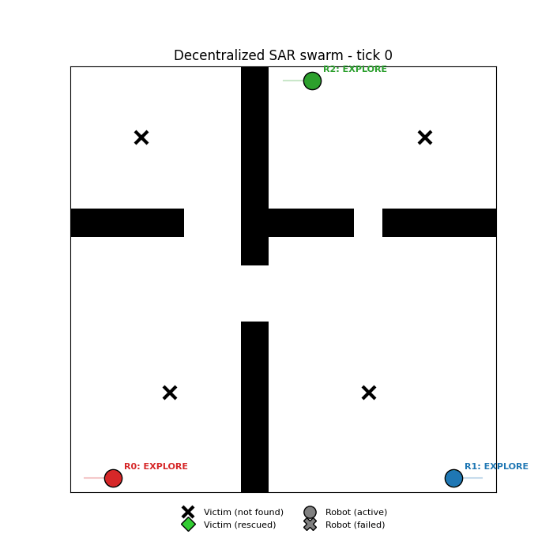

# swarm-rescue-bt

Five decentralized multi-robot swarm simulations, written in pure Python
with **no ROS2 / Nav2 / Gazebo dependency**. Each one exists to validate a
coordination architecture — behavior trees driving fully local decisions,
with no central arbiter — before porting it onto a real robotics stack.



## What it demonstrates

The flagship mission (`rescue`, the original demo): three ground robots
start from opposite corners of a 15×15 grid map hiding 4 victims. Each
robot runs its own behavior tree and knows only its own position, what
its sensors currently detect, and what its radio has received — no robot
ever sees the whole board. At tick 11, robot 1 is scripted to fail right
after claiming a victim. The other two robots notice the claim has gone
stale and pick up the mission with no outside intervention, which is the
whole point of the demo: coordination that *emerges* from local rules,
not from a scheduler.

Four more missions (see [Missions](#missions) below) explore the same
idea in different shapes — patrolling a shared perimeter, holding a
communication relay chain, hunting a moving target, and a two-team
capture-the-flag contest. Every mission has a parameter-identical twin on
the `centralized-swarm` branch, so the same scenario can be run on both
to see which architecture actually suits it better, rather than
reasoning about it in the abstract.

## How it's structured

- **`missions/<name>.py`** — one file per mission (`rescue`, `patrol`,
  `relay`, `wolfpack`, `capture_flag`), each defining its own robot
  class(es), `SCENARIOS` dict, `build_scenario`/`run`/`print_log`/
  `summarize`, and the map decorations `sim.py` needs to render it
  (`draw_extra`/`legend_handles`). `missions/common.py` holds the handful
  of things every mission shares (the color palette, the py_trees
  tree-snapshot helper).
- Every mission's tree is built with
  [py_trees](https://py-trees.readthedocs.io/) (`Selector`, `Sequence`,
  one `py_trees.behaviour.Behaviour` subclass per leaf), using the same
  node-naming taxonomy BehaviorTree.CPP / Nav2 uses (`nav2_behavior_tree`)
  - `NavigateToPose` means the same thing (BFS-walk one cell toward a
  goal) in every mission, whatever leaf currently owns picking that goal.
- **`swarm/world.py`** — a 2D grid with obstacles and BFS pathfinding,
  standing in for Nav2's global planner + local controller (give a path
  to a goal, advance one cell).
- **`swarm/comms.py`** — a simulated radio bus: broadcast with limited
  range and one tick of latency. It never makes decisions — it only
  propagates messages. Used by `rescue` (claims) and `wolfpack` (prey
  sightings); `patrol`, `relay`, and `capture_flag` need no radio at all,
  since nothing in them is decided from what another robot says.
- **`sim.py`** — mission-agnostic driver: CLI parsing, the shared
  render/GIF/`--live`/`--slider`/`--compare` machinery, dispatching to
  whichever `missions/<name>.py` module `--mission` selects.

## Running it

```bash
pip install -r requirements.txt
python3 sim.py
```

This prints a text log of the robots' decisions (who claims what, who
rescues whom, the scripted failure) and writes an animation to
`output/sar_swarm_demo.gif`. The animation is a dashboard: the map (with
a motion arrow per robot) plus each robot's full behavior tree, every
node color-coded by its live py_trees status.

Add `--live` to open an interactive matplotlib window that autoplays
instead of only saving the GIF, or `--slider` for the same window paused
with a tick slider and Play/Pause button to scrub by hand (both require a
display):

```bash
python3 sim.py --live
python3 sim.py --slider
```

## Missions

`python3 sim.py --mission NAME` picks a mission (default `rescue`);
`--scenario NAME` then picks one of that mission's own scenarios
(`--mission`/`--scenario` accept an invalid name too, and list the valid
ones in their error message). `python3 sim.py --mission NAME --compare`
runs every scenario of that mission headlessly (no GIF/window) and prints
a comparison table - this is also the project's end-to-end test: a
scenario that raises or never finishes (DNF) inside its `max_ticks` is a
real bug.

### `rescue` (default)

Search a grid for victims and rescue them; task allocation emerges from
robots broadcasting claims over the radio bus. See
[What it demonstrates](#what-it-demonstrates) above.

| scenario | what it changes | what it tests |
| --- | --- | --- |
| `default` | 3 robots, 4 victims, 15×15, one scripted failure | the baseline demo |
| `many_victims` | same robots/map, 9 victims | claim contention when victims outnumber robots |
| `robot_heavy` | 6 robots, 2 victims | over-provisioning / idle-robot behavior |
| `large_map` | 25×25 map, 5 robots, 7 victims, one failure | scaling to a bigger map and swarm |
| `double_failure` | robots 1 and 0 both fail (ticks 11 and 64) | resilience when the swarm loses most of its capacity |
| `short_sensors` | `sensor_range` roughly halved (1.2) | how much perception range matters when claiming is peer-arbitrated |

### `patrol`

N robots split a shared border loop into contiguous arcs, computed from
nothing but each robot's own id and the total robot count - no
negotiation needed since every robot computes the same split
independently. The cost of that simplicity: if a robot dies, nobody
reassigns its arc, so it just goes unpatrolled.

| scenario | what it changes | what it tests |
| --- | --- | --- |
| `default` | 4 robots patrol a 15×15 border, no failures | full coverage |
| `robot_down` | robot 1 fails almost immediately (tick 3) | its whole arc goes unpatrolled forever - static assignment has no reflow |
| `double_failure` | robots 1 and 2 both fail (ticks 3 and 30) | roughly half the loop goes unpatrolled instead of a quarter |
| `large_map` | 25×25 map, 6 robots, no failures | scaling to a bigger loop and swarm |

### `relay`

N robots hold evenly-spaced positions between a fixed source and sink so
every consecutive hop stays within `comm_range`, relaying a message end
to end. Each robot's slot is a fixed function of its own id - again, no
negotiation needed, and again no reflow if a robot dies.

| scenario | what it changes | what it tests |
| --- | --- | --- |
| `default` | 3 robots hold a chain from corner to corner | the chain stays intact |
| `robot_down` | the middle relay robot fails after settling in | the chain breaks exactly where it was - nobody closes the gap |
| `double_failure` | 2 of 3 relay robots fail (ticks 25 and 35) | only the robot closest to the source survives - one huge unbridged gap (15.0) instead of one broken link (10.0) |
| `long_chain` | 25×25 map, 5 robots, corner to corner | scaling to a longer path and a bigger swarm |

### `wolfpack`

N robots hunt one evasive prey that flees whichever robot is nearest once
it notices one. A robot that spots the prey broadcasts the sighting, and
every robot converges on the most recent sighting it's heard, whether it
can currently see the prey or not - the one mission here where
decentralized peer-to-peer sharing is a genuine strength, not a
liability, since a robot dying doesn't erase what it already told
everyone else.

| scenario | what it changes | what it tests |
| --- | --- | --- |
| `default` | 3 robots hunt 1 prey, no failures | a straightforward hunt |
| `robot_down` | the robot that first spots the prey fails right after reporting it | the trail survives - another robot picks up the chase from the broadcast sighting |
| `many_hunters` | 5 robots hunt 1 prey, same map | over-provisioning - more of the pack doesn't obviously mean a faster capture (in practice: same 41 ticks as `default`, since initial detection dominates) |
| `large_map` | 25×25 map, 5 robots hunt 1 prey | scaling to a bigger hunting ground |

### `capture_flag`

Two teams (red/blue) race to touch the enemy's flag; a robot caught
within `tag_range` of an enemy robot while on that enemy's side of the
map respawns at its own start. Flag positions are common knowledge (no
detection phase), so there's no task to allocate - every robot on both
architectures just always heads for the enemy flag. This mission has the
least architecture-comparison value of the five for exactly that reason:
there's nothing for a Coordinator to decide differently.

| scenario | what it changes | what it tests |
| --- | --- | --- |
| `default` | 3v3, symmetric starts | a fair fight |
| `outnumbered` | red (2) vs blue (5) | more attackers *and* more incidental defenders |
| `many_v_many` | 5v5, symmetric starts | more simultaneous attackers/defenders on both sides - more skirmishes near the midline |
| `large_map` | 25×25 map, 3v3 | scaling to a longer race with more room to maneuver |

## Why it's decentralized

No process holds a global view of the swarm's state or arbitrates
conflicts. Each robot only knows its own position, what its sensors
detect, and what the radio has delivered to it. Removing a robot from a
scenario's robot list doesn't break the others - `rescue`'s and
`wolfpack`'s scripted-failure scenarios demonstrate that directly;
`patrol`'s and `relay`'s demonstrate the flip side of the same coin, where
that same absence of a coordinator means nobody reflows a dead robot's
work either.

## Toward a real multi-robot Nav2 stack

This prototype simplifies two things to stay readable:

1. **Navigation** — BFS on a known grid stands in for Nav2
   (`bt_navigator` + `planner_server` + `controller_server`). On a real
   stack, each robot would run its own Nav2 instance in its own ROS2
   namespace (`/robot_0/...`, `/robot_1/...`), and the
   `PickExploreGoal` / `ClaimVictim` / `NavigateToPose` nodes here would
   become BT.CPP nodes calling Nav2's `NavigateToPose` action instead of
   moving a point on a grid — see the `nav2-port` branch, which does
   exactly this with the same BT leaf names.
2. **Radio** — `radio_range` is deliberately generous (close to the
   whole map) to keep things simple. On ROS2 this would be a DDS topic
   (`/swarm/claims`) with best-effort QoS — DDS natively handles
   peer-to-peer discovery with no central master, which matches this
   prototype's "no arbiter" assumption exactly.

The claim / timeout / recovery logic itself carries over unchanged — it's
the part that actually validates decentralized coordination, independent
of whatever navigation stack sits underneath.

---

*[Version française](README.fr.md)*
